# Data Science

## IBM SPSS Modeler

Estas herramientas las encontraras en [![IBM Cloud Powered][img-ibmcloud-powered]][url-ibmcloudP]

Puedes encontrar más información de **IBM Data Science** en [![IBM Data Science][img-ibmcloudds]][url-ibmcloudds]

Para **Data Science**, **IBM Cloud** tiene herramientas como:
* [![Watson Studio][img-WS]][url-WS] Que simplifica y escala la ciencia de datos para predecir y optimizar el porvenir de los negocios.
* Spark MLib: la biblioteca escalable de aprendizaje automático de Apache Spark.
* [![IBM SPSS Modeler][imgspss]][urlspss] Que impulsa el retorno de la inversión con una herramienta de ciencia de datos de arrastrar y soltar. 

[urlspss]: https://www.ibm.com/products/spss-modeler 

## Antes de empezar te recomendamos:
* Realizar el [PreWork](#Prework).
* Si eres estudiante o profesor y tienes correo institucional te recomendamos los [Cupones](#Cupones-para-profesores-y-estudiantes).
* Si tienes algun codigo promocional te decimos como [Aplicarlos](#Cargar-créditos-en-IBM-Cloud).

## Prework:
* Cuenta de [IBM Cloud][url-IBMCLOUD]
* Instalar [CLI de IBM Cloud][url-CLI-IBMCLOUD] (para descargar la versión “STANDALONE” [**aquí**](https://cloud.ibm.com/docs/cli?topic=cloud-cli-install-ibmcloud-cli))
* Cuenta en [GitHub][url-github-join]
* Instalar [CLI de GitHub][url-github-cli] o instalar [GitHub Desktop][url-githubdesktop]

* FORK y descargar el repositorio del siguiente **enlace**: https://github.com/ibmdevelopermx/DataScience-ModelerFlow

# Índice
* [Crear una instancia en **IBM Cloud Object Storage**](#Crear-una-instancia-en-IBM-Cloud-Object-Storage).
* [Crear una instancia en **Watson Studio**](#Crear-una-instancia-en-Watson-Studio).
* [Crear el Asset **“Modeler Flow”** y los modelos de regresión, clasificación y  clusterización](#Crear-el-Asset-Modeler-Flow-y-los-modelos-de-regresión,-clasificación-y-clusterización)
    -   [Modelo de regresion logística](#Modelo-de-regresion-logística).
    -   [Modelo de Clasificación](#Modelo-de-Clasificación).
    -   [Modelo de Clusterización](#Modelo-de-Clusterización).
* [Desplegar y probar el modelo](#Desplegar-y-probar-el-modelo).

# Crear una instancia en IBM Cloud Object Storage
1. Dentro de nuetra nube, buscamos en la parte superior nuestro boton de catalog.
2. En la lista de lado izquierdo buscamos "Storage".
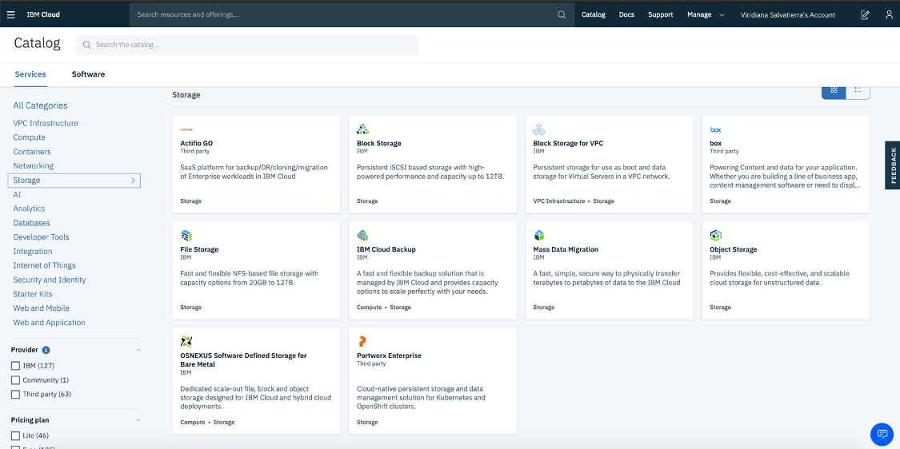
3. Seleccionamos el plan **LITE**, asiganmos un nombre y tags para identificarlo facil. y click en crear.
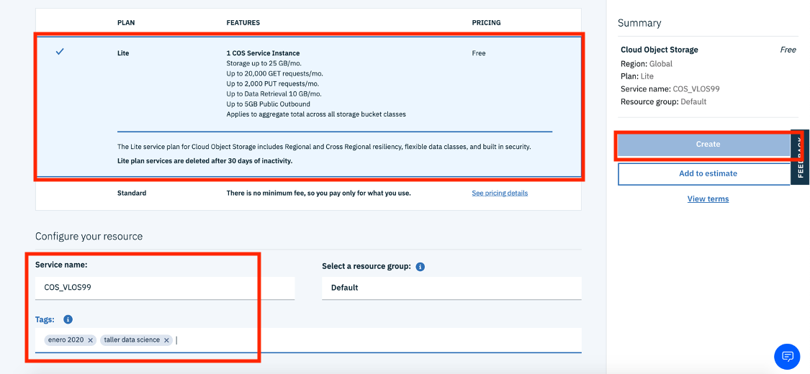

# Crear una instancia de Watson Studio
1. Regresamos a la ventana inicial de nuestra pagina con click en la parte superior derecha en "IBM CLOUD".
2. Seleccionamos "Catalog" y en la lista buscamos "AI".
3. Seleccionamos **Watson  Studio**.
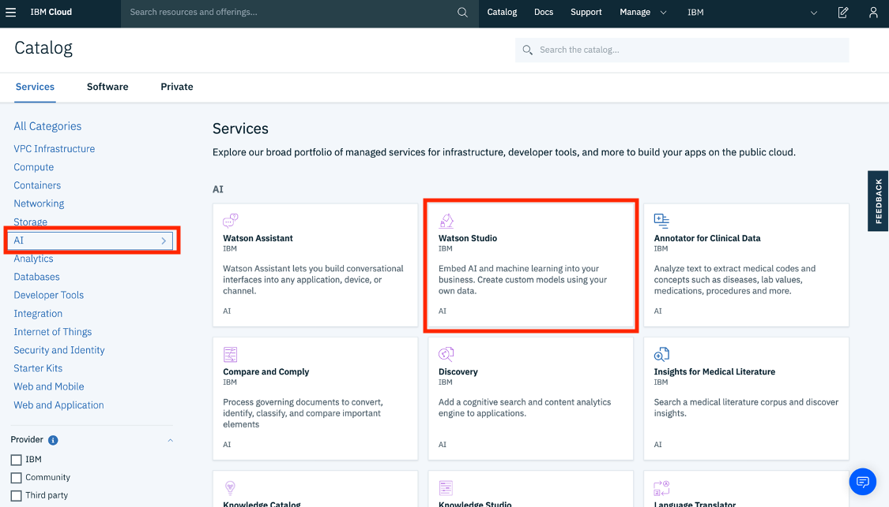
4. Seleccionamos la region mas cercana (por lo general "DALLAS"), version **LITE**
5. Asignamos un nombre y etiquetas para su facil identificación, grupo de recursos el predeterminado (DEFAULT) y click al boton de "CREATE".
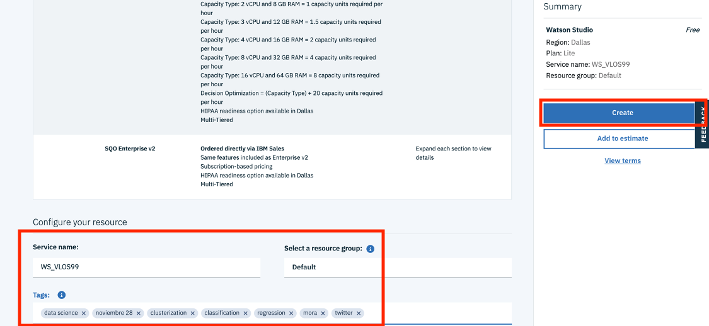
6. En la ventana siguiente damos click en "GET STARTED".
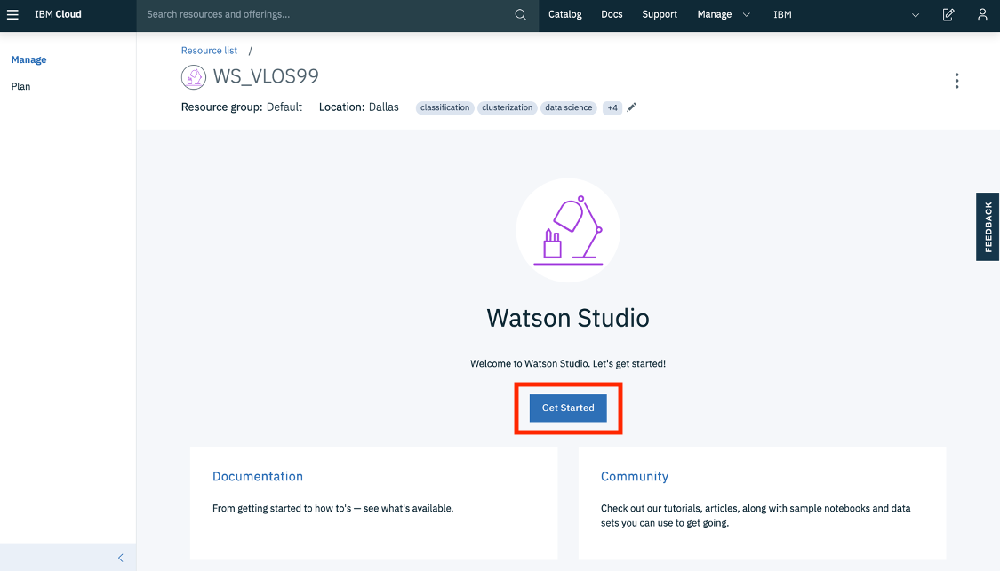
7. Ya dentro de **Watson Studio** crearemos un nuevo proyecto con la opción "Create a Project".
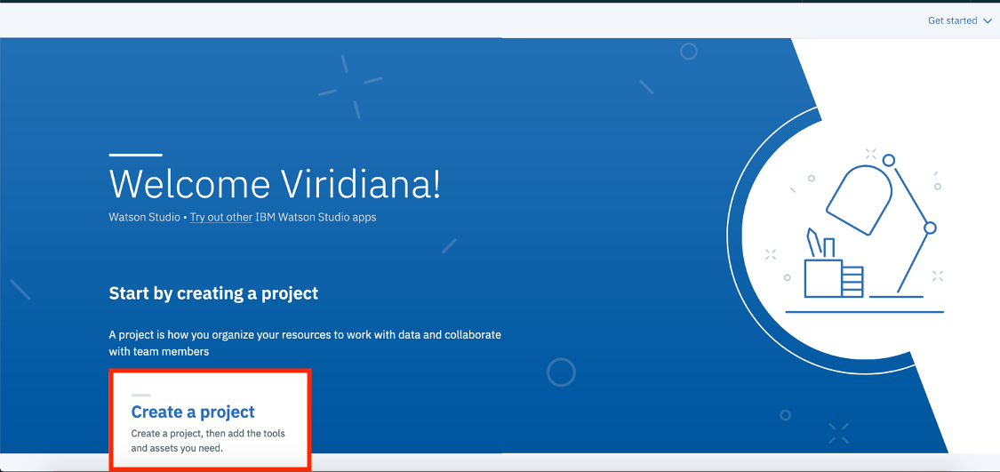
8. Luego seleccionamos la opción "Create an empty project"
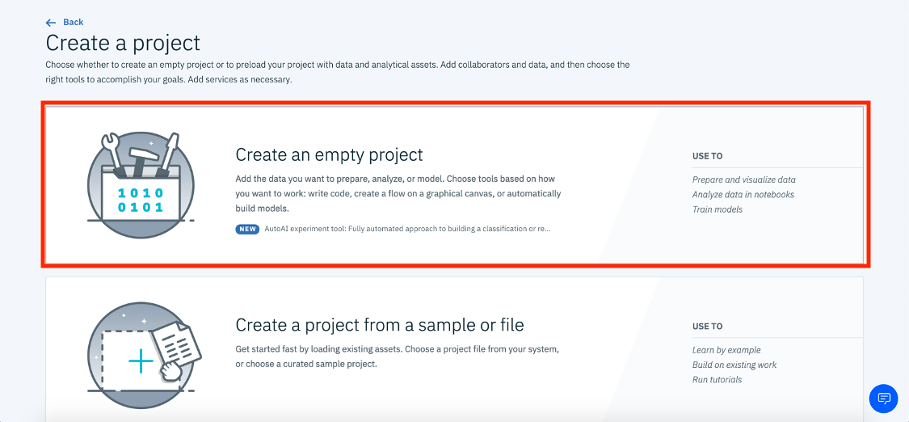
9. Le damos un nombre a nuestro projecto y comprobamos que este conectada a nuetra instancia de **Cloud Object Storage**. De ser asi, avanzamos con "Create".
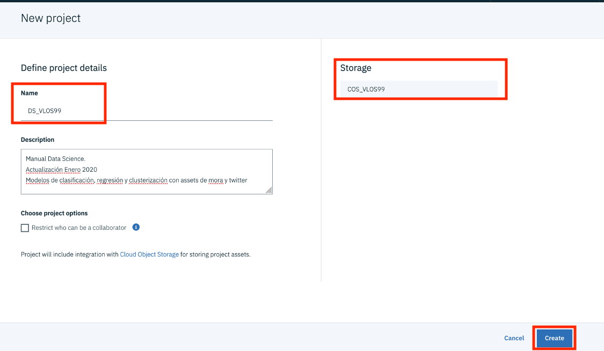
10. Dentro del projecto que hemos creado,  buscamos la pestaña de "Assets".
11. Para agregar uno nuevo, en la pestaña pequeña de lado superior derecho con el logo , nos dara una barra de opciones donde encontraremos una pestaña que dice "Load". En ella nos aparecera "Browse" que nos permitira subir datos con draganddrop o buscandolos.
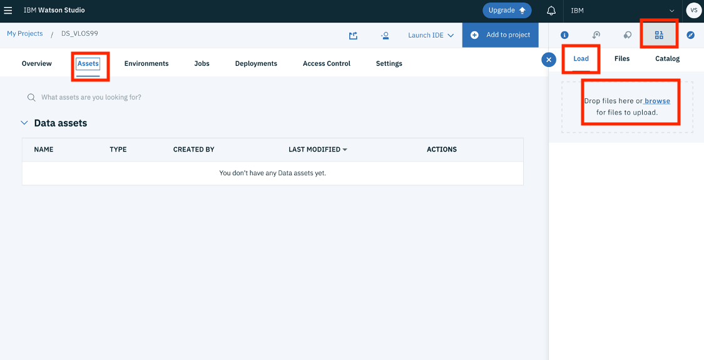
12. subiremos 3 archivos que se descargaron al clonar el repositorio, que son "mora.csv", "twitter.csv" y "twitter.xlsx".
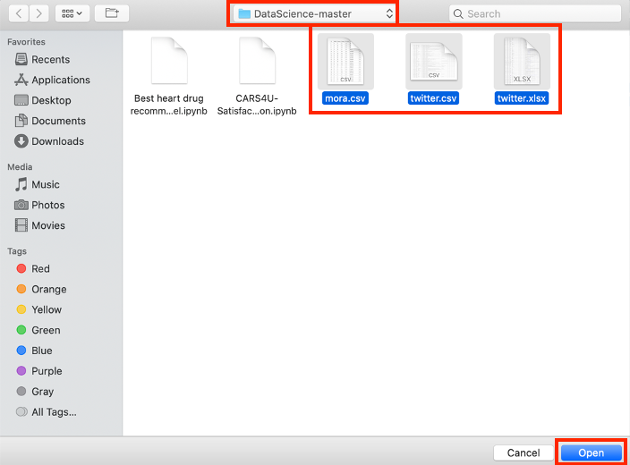

**nota: esto puede tardar unos minutos, y los necesitamos para avanzar, por lo que hay que esperar a que suban completos.**

# Crear el Asset **Modeler Flow** y los modelos de regresión, clasificación y  clusterización.

1. Una vez que los documentos se encuentren en el apartado “Data Assets”, en la parte superior de la página, seleccionamos “+ Add to project”.
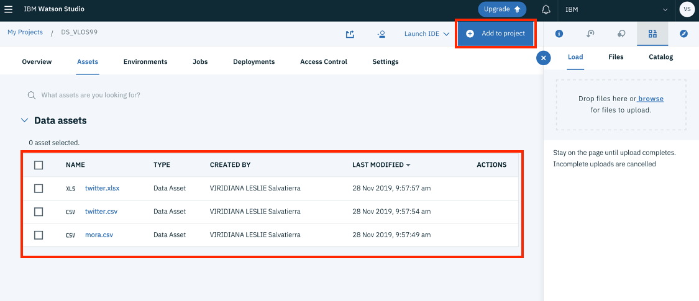
2. Elegimos el tipo de asset "Modeler Flow".
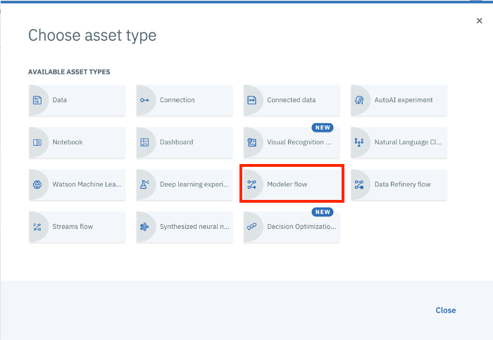
3. Seleccionamos la pestaña "new".
4. Le damos un nombre a nuestro "Modeler Flow" con una pequeña descripción.
5. En tipo de flujo seleccionamos "Modeler Flow".
6. En "runtime", seleccionamos **IBM SPSS Modeler**.
7. Damos click en "create".
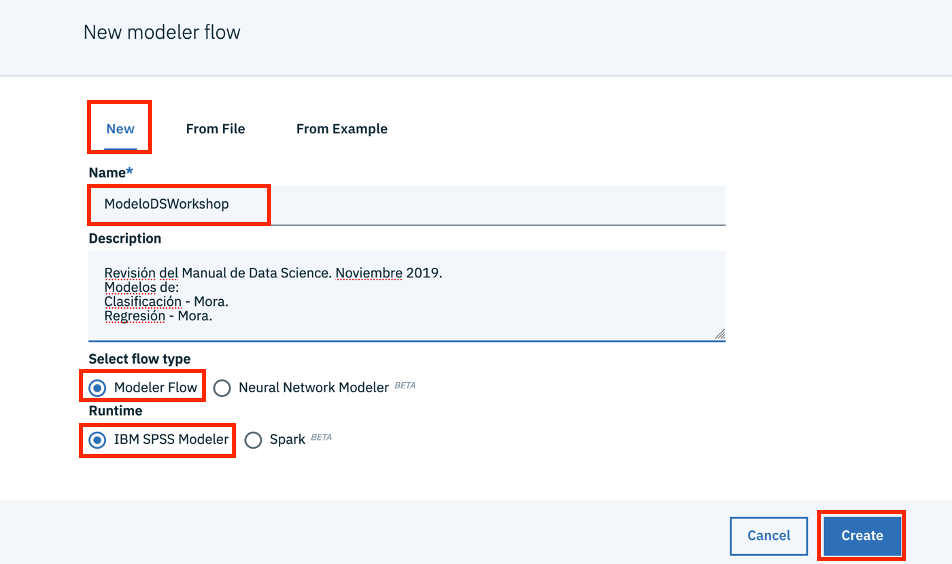
## Modelo de regresion logística.
1. Del menú en la parte izquierda, seleccionamos la pestaña “Import”, buscamos el nodo “Data Asset” y lo arrastramos al área se trabajo.
2.	Del menú en la parte izquierda, seleccionamos la pestaña “Field Operations”, buscamos el nodo “Type”, lo arrastramos al área se trabajo y lo unimos con el nodo “Data Asset”.
3.	Del menú en la parte izquierda, seleccionamos la pestaña “Modeling”, buscamos el nodo “Logistic”, lo arrastramos al área se trabajo y lo unimos con el nodo “Type”.
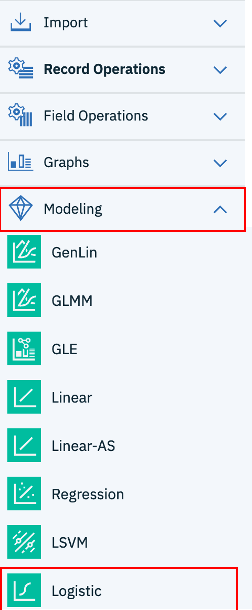
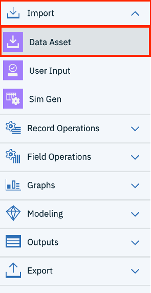
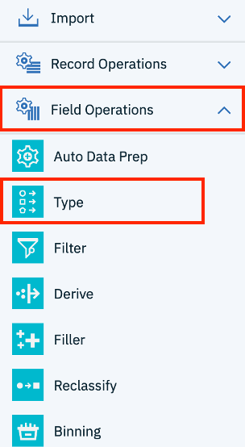
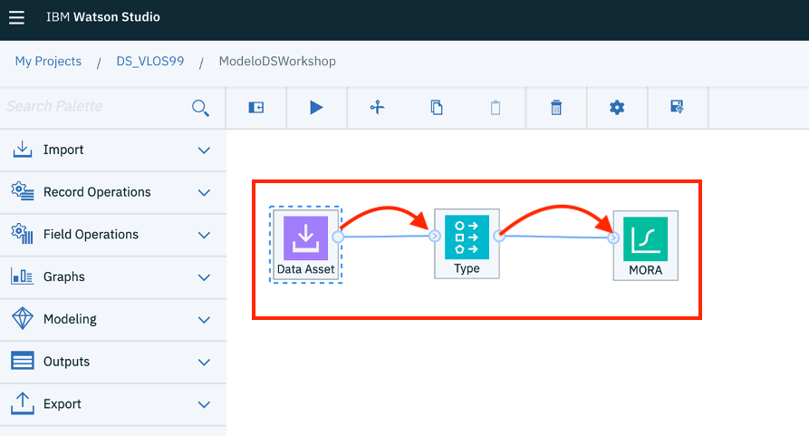
4.	Damos doble clic en el nodo “Data Asset” y del lado derecho, demos clic en “Change data asset”.
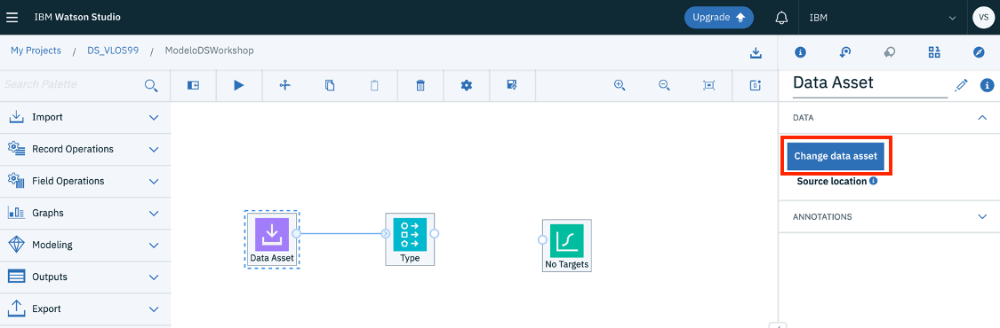
5.	Seleccionamos “Data assets”, seleccionamos “mora.csv” y damos clic en “Ok”.
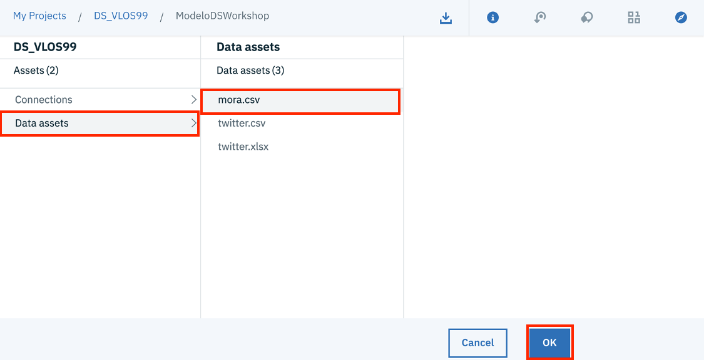
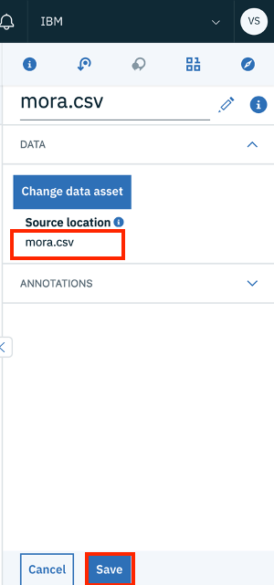
6.	Una vez que hayamos regresado a la página del modelo, en el apartado del lado derecho comprobamos que el asset sea el correcto, damos clic en “Save” y esperamos a que se cargue la información.

7.	A continuación, damos doble clic en el nodo “Type” y del lado derecho, nos aseguramos de que todos tengan el valor “read” en el apartado “Value Mode” se tengan los siguientes valores para los siguientes campos:

VALOR:              CAMPOS:
“Continuous” = “N_Hijos”, “Estimación_Ingreso”.
“Categorical” = “ID”, “Plan”.
“Flag”      =        “Mora”, “Genero”, “Estatus”.

8.	En el apartado “Role”, seleccionamos el valor “Both” para el campo “Mora”, en todos los demás campos, mantenemos en el valor “Input” y finalmente damos clic en el botón “Save”.
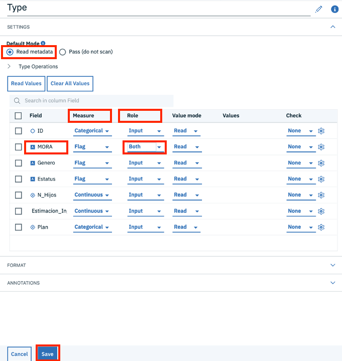
9.	Ahora, damos doble clic en el nodo “Logistic” (usualmente tiene la leyenda “No Target”).
10.	Del lado derecho, activamos la casilla “Use custom field roles”, en el apartado “Target”, seleccionamos el valor “Mora” del menú desplegable, en el apartado “Inputs”, damos clic a “Add Columns”.
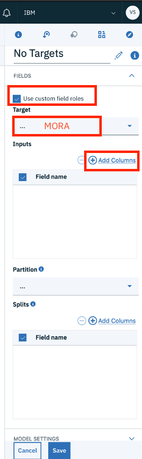
11.	Seleccionamos todos los campos y damos clic en “Ok”.
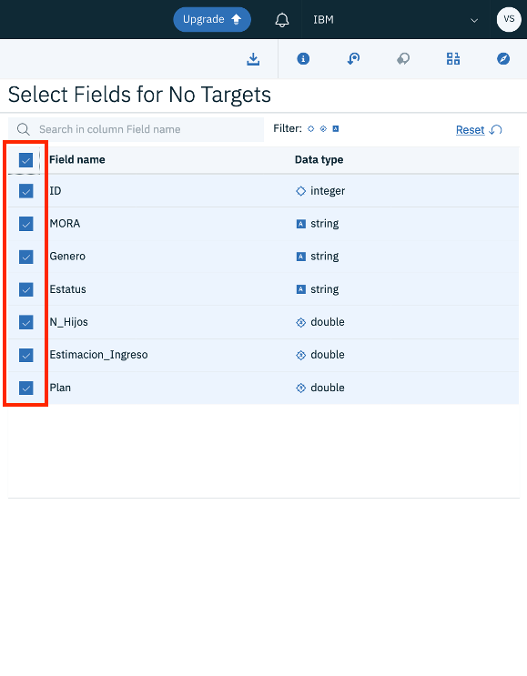
12.	Una vez hecho esto, damos clic en “Save”.
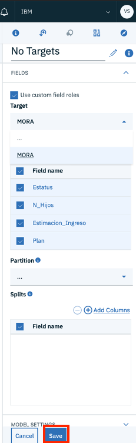
13.	Ahora, damos clic en el ícono “play” para correr el flujo y generar el modelo.
14.	En cuanto se genere el modelo, podremos ver un nodo nuevo de color naranja.
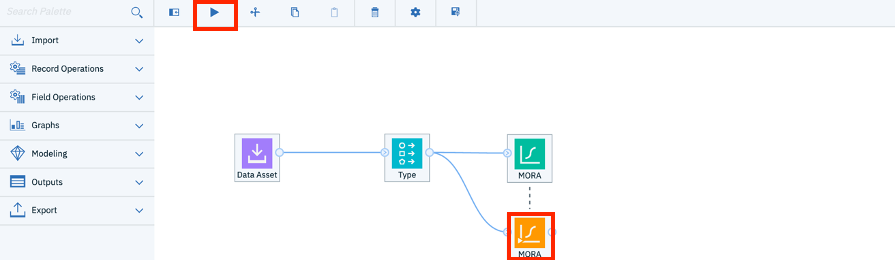
15.	Para guardar el modelo, damos clic en el último ícono, “save model”, de la barra superior (la misma de la que seleccionamos “play”), para guardar el modelo.
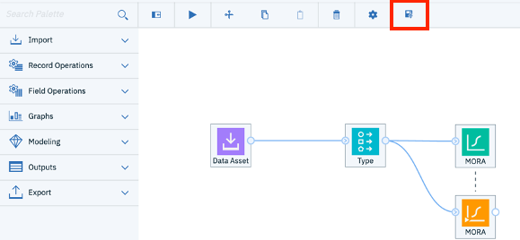
16.	Al aparecer el siguiente mensaje, dar clic en el texto subrayado “Create a new Watson Machine Learning service instance”.
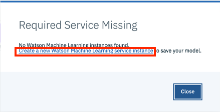
17.	Seleccionamos la opción de PLAN “Lite” y le damos clic en “Create” ubicado al final de la página (hasta abajo).
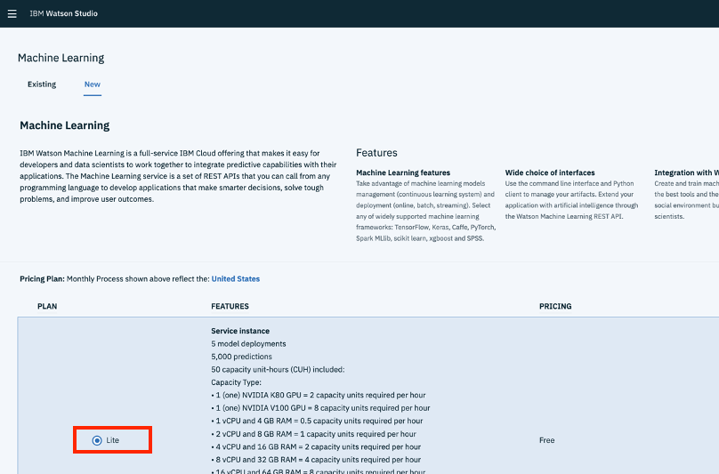
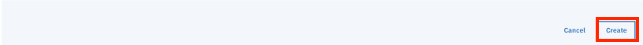
18.	Seleccionamos la región “Dallas”, en plan, dejamos “Lite”, en grupo de recursos seleccionamos el valor “Default” y le damos un nombre original a la instancia de servicio (Recuerda que esa instancia la usaremos para diferentes proyectos). Hecho esto, damos clic en “Confirm”.
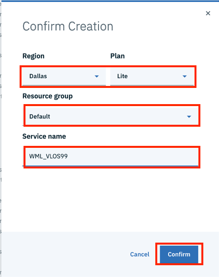
19. Hecho esto, regresaremos a la página de nuestro “modeler flow” y volvemos a dar clic en el botón       “save model”. 
20.	En el apartado de guardado de modelo, seleccionamos la opción “Individual algorithm as PMML”, seleccionamos “MORA” como nodo de modelo aplicador, le damos un nombre original al modelo, revisamos que sea correcto el nombre de nuestro servicio de “Watson Machine Learning” y damos clic en “Save”.
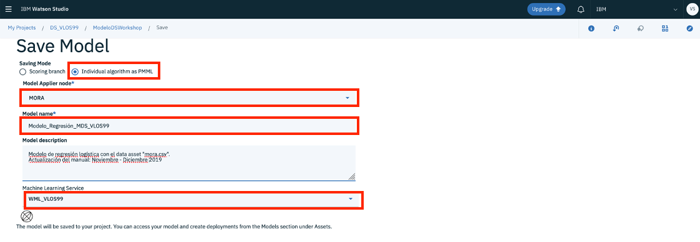

Ahora puedes pasar a:
[Desplegar y probar el modelo](#Desplegar-y-probar-el-modelo).

## Modelo de clasificación.
1.	Ya que guardamos el modelo, vamos a eliminar todos los nodos del área de trabajo. Para esto, seleccionamos un nodo y damos clic en el ícono de borrar “el clasico bote de basura” de la barra superior, repetimos el proceso para todos los nodos.
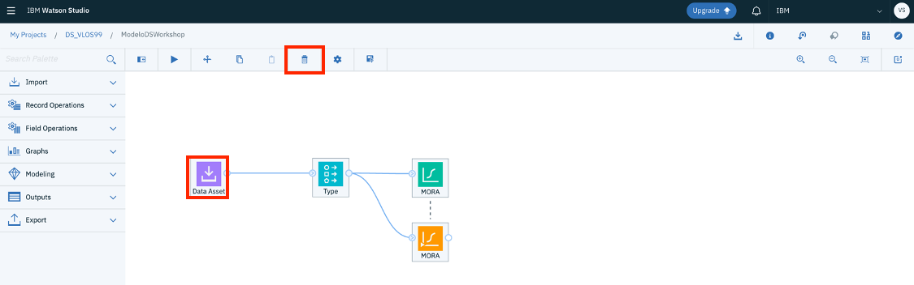
2.	En cuanto tengamos nuestra área de trabajo limpia, del menú en la parte izquierda, seleccionamos la pestaña “Import”, buscamos el nodo “Data Asset” y lo arrastramos al área se trabajo.
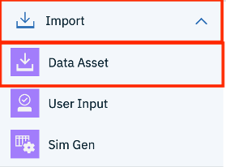
3.	Del menú en la parte izquierda, seleccionamos la pestaña “Field Operations”, buscamos el nodo “Type”, lo arrastramos al área se trabajo y lo unimos con el nodo “Data Asset”.
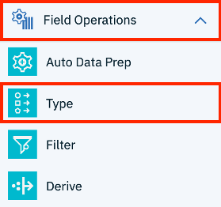
4.	Del menú en la parte izquierda, seleccionamos la pestaña “Modeling”, buscamos el nodo “Auto Classifier”, lo arrastramos al área se trabajo y lo unimos con el nodo “Type”.
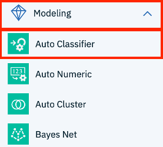
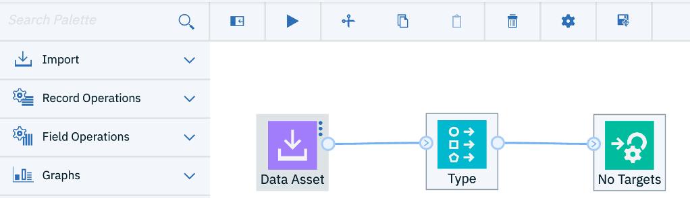
5.	Damos doble clic en el nodo “Data Asset” y del lado derecho, demos clic en “Change data asset”.

6.	Seleccionamos “Data assets”, seleccionamos “mora.csv” y damos clic en “Ok”.
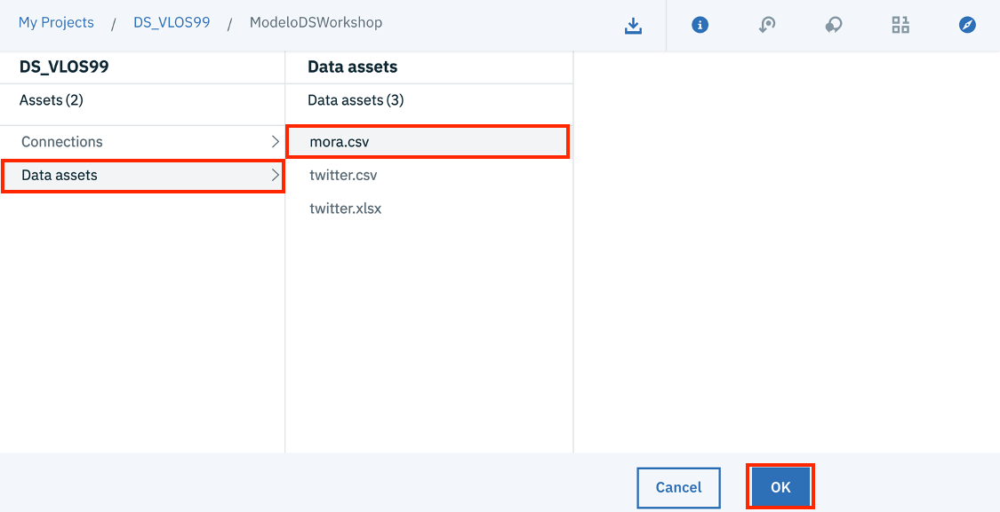
7.	Una vez que hayamos regresado a la página del modelo, en el apartado del lado derecho comprobamos que el asset sea el correcto, damos clic en “Save” y esperamos a que se cargue la información.
8. A continuación, damos doble clic en el nodo “Type” y del lado derecho, nos aseguramos de que todos tengan el valor “read” en el apartado “Value Mode” se tengan los siguientes valores para los siguientes campos:

VALOR:              CAMPOS:
“Continuous” = “N_Hijos”, “Estimación_Ingreso”.
“Categorical” = “ID”, “Plan”.
“Flag”      =        “Mora”, “Genero”, “Estatus”.

9. En el apartado “Role”, seleccionamos el valor “Both” para el campo “Mora”, en todos los demás campos, mantenemos en el valor “Input” y finalmente damos clic en el botón “Save”.
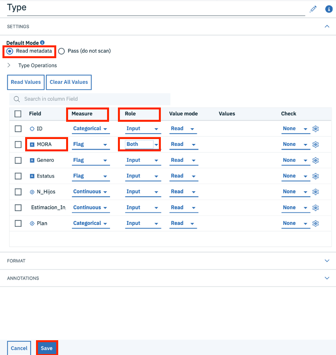
10. Damos doble clic al nodo “Auto Classifier” (el que tiene la leyenda “No Target”).
11.	 Del lado derecho, activamos la casilla “Use custom field roles”, en el apartado “Target”, seleccionamos el valor “Mora” del menú desplegable, en el apartado “Inputs”, damos clic a “Add Columns”.
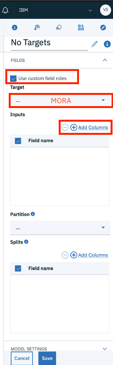
12.	Seleccionamos todos los campos y damos clic en “Ok”.
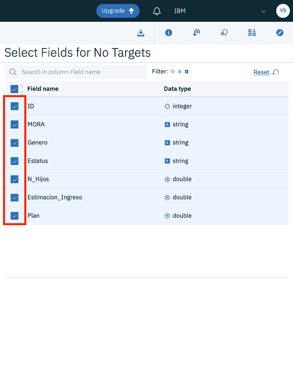
13.	Una vez hecho esto, damos clic en “Save”.

14. Ahora, damos clic en el ícono “play” para correr el flujo y generar el modelo.
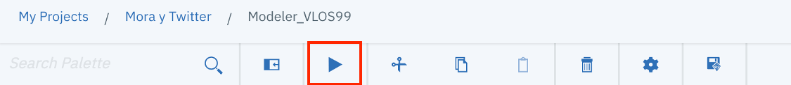
15. En cuanto se genere el nodo modelo (de color naranja), damos clic en el menú de hamburguesa del nodo (los tres puntos verticales que aparecen al pasar el apuntador sobre él) y damos clic en “View Model”. 
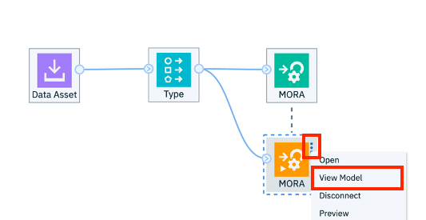
16. Vemos los modelos que se generaron y regresamos a nuestro “Modeler Flow” dando clic en su nombre en la barra de herramientas superior.
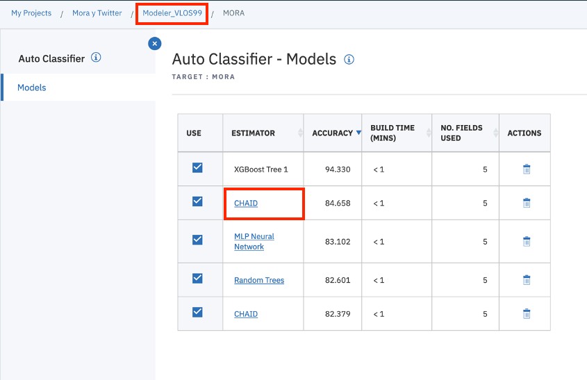
17. Una vez hecho esto, seleccionamos el nodo de modelado (“Modeling”) que haya resultado con mayor certeza. No es recomendable usar XGBoost Tree, por lo que, en mi caso, utilizaré el nodo “CHAID”. Lo arrastramos al área de trabajo y lo conectamos con el nodo “Type”.

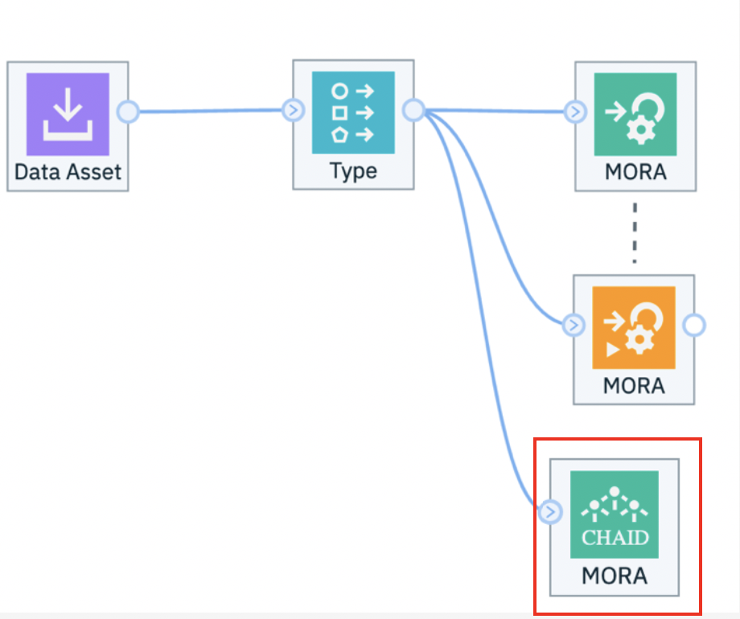
18. Le damos doble clic al nodo que acabamos de agregar.
19.	Del lado derecho, activamos la casilla “Use custom field roles”, en el apartado “Target”, seleccionamos el valor “Mora” del menú desplegable, en el apartado “Inputs”, damos clic a “Add Columns”(Si tienes problemas en este paso, debes revisar que el nodo “Type” tenga los valores que configuramos en los pasos 8 y 9).
20.	Seleccionamos todos los campos y damos clic en “Ok”.
21.	Una vez hecho esto, damos clic en “Save”. 
22.	Una vez hecho esto, damos clic en el ícono “play” para correr el flujo y generar el nuevo modelo.
23.	Una vez desplegado el nodo del nuevo modelo, vamos a guardar nuestro modelo.
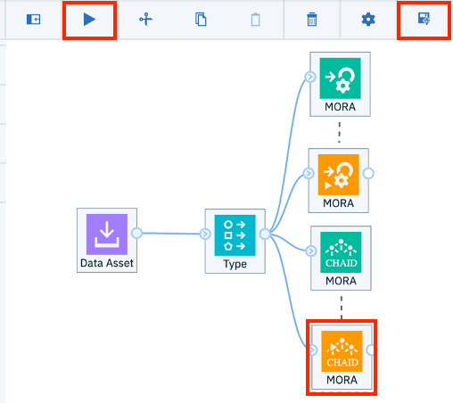
24.	Seleccionamos “Individual algorithm as PMML” y llenamos los siguientes campos:

Ahora puedes pasar a:
[Desplegar y probar el modelo](#Desplegar-y-probar-el-modelo).

## Modelo de Clusterización. 
1.	Ya que guardamos el modelo, vamos a eliminar todos los nodos del área de trabajo. Para esto, seleccionamos un nodo y damos clic en el ícono de borrar “” de la barra superior, repetimos el proceso para todos los nodos.
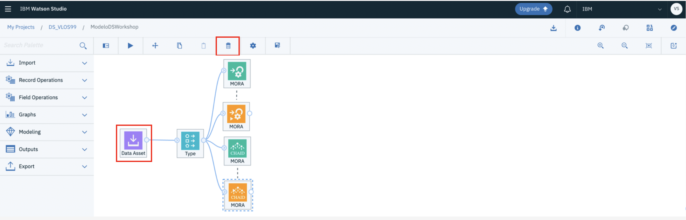
2.	En cuanto tengamos nuestra área de trabajo limpia, del menú en la parte izquierda, seleccionamos la pestaña “Import”, buscamos el nodo “Data Asset” y lo arrastramos al área se trabajo.
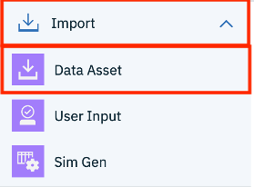
3.	Del menú en la parte izquierda, seleccionamos la pestaña “Field Operations”, buscamos el nodo “Type”, lo arrastramos al área se trabajo y lo unimos con el nodo “Data Asset”.
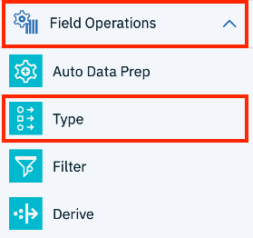
4.	Del menú en la parte izquierda, seleccionamos la pestaña “Modeling”, buscamos el nodo “Auto Cluster”, lo arrastramos al área se trabajo y lo unimos con el nodo “Type”.
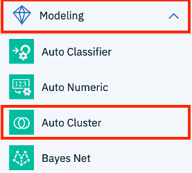
5.	Ahora damos doble clic en el nodo “Data Asset” y seleccionamos la opción “Change data asset”.
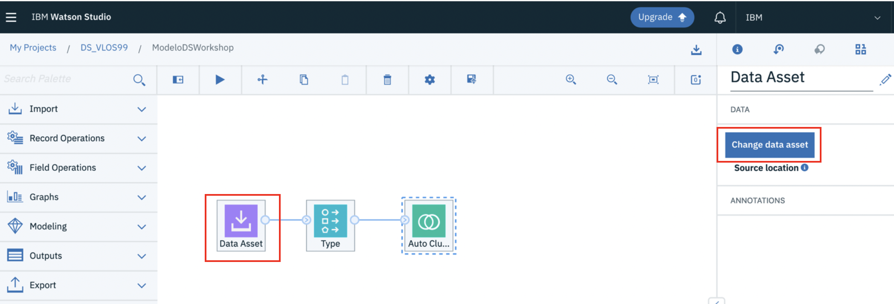
6.	Damos clic en “Data assets”, seleccionamos “twitter.csv” y damos clic en “OK”.
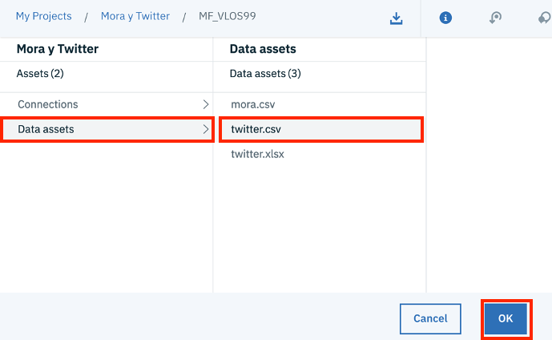
7.	Ahora le daremos el valor de “Categorical” en el apartado de “Measure” a los siguientes campos: “Followers, Friends, Tweets, % of tweets w/U…, %retweets in …, % tweets w@..., social Authority” y damos clic en “Save”
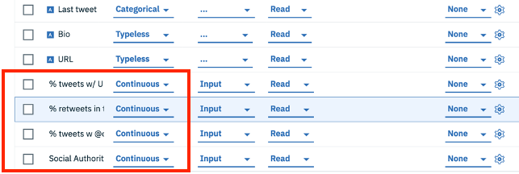
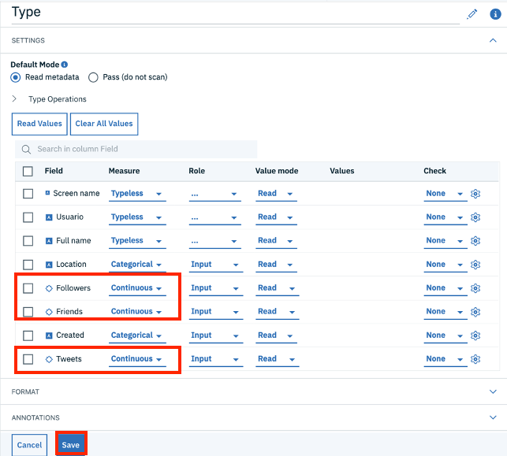
8.	Ahora, damos doble clic en el nodo “Auto cluster”. Seleccionamos el recuadro “Use custom field roles”, una vez activada la casilla, damos clic en “Add columns”, seleccionamos todos los campos y damos clic en “OK”. Una vez hecho esto, damos clic en el ícono “play” para correr el flujo y generar el nuevo modelo.
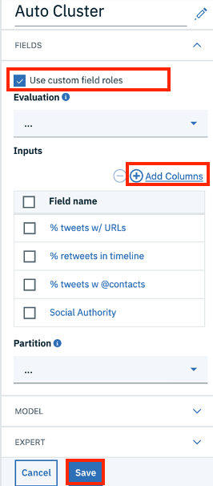
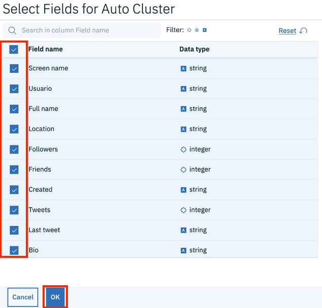
9.	Una vez desplegado el modelo nuevo, damos clic en el menú de hamburguesa y seleccionamos la opción “View model”. Allí podremos apreciar la certeza de cada modelo. Elegimos el más certero, en mi caso, “K-means” y regresamos a nuestro modelador de flujo dando clic en el nombre en la barra de direcciones bajo el emblema de Watson Studio.
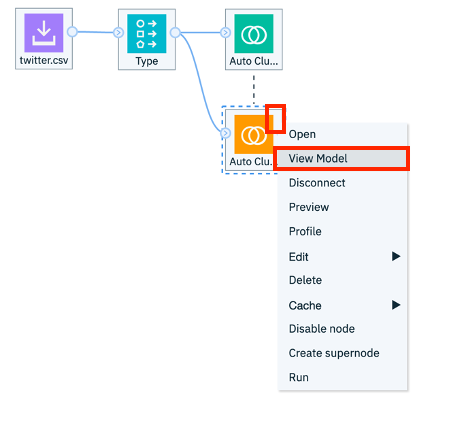
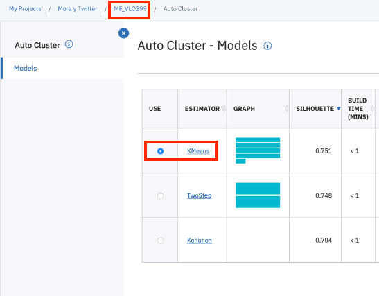
10.	Una vez de regreso en nuestra área de trabajo, del menú desplegable de la izquierda, seleccionamos el apartado “Modeling”, lo arrastramos al área de trabajo el nodo de “K-Means” y lo unimos con el nodo “Type”.

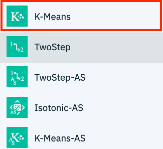
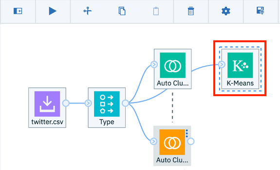
11.	Ahora damos doble clic en el nodo “K-Means”. Seleccionamos la casilla “Use custom field roles”, hecho esto, damos clic en “Add columns”, seleccionamos todos los campos y damos clic en “OK”.
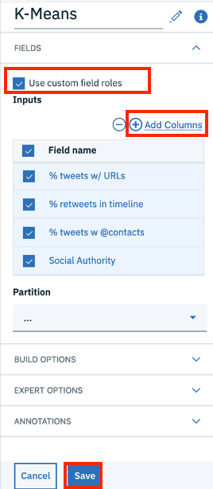
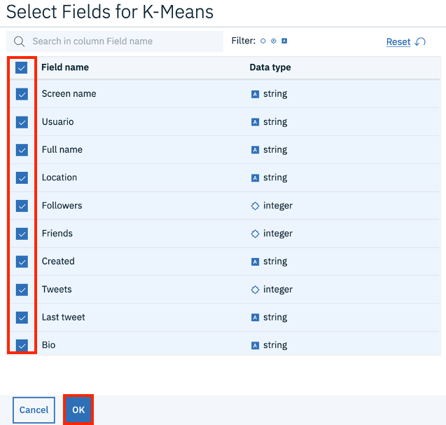
12.	Una vez hecho esto, damos clic en el ícono “play” para correr el flujo y generar el nuevo modelo.
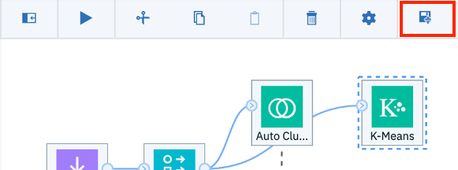
13.	Ahora, guardamos el modelo. Damos clic en el ícono de “Save Model”, marcamos la opción “individual algorithm as PMML”, en “Model applier node”, seleccionamos “K-Means”, le damos un nombre al modelo y damos clic en “Save”.
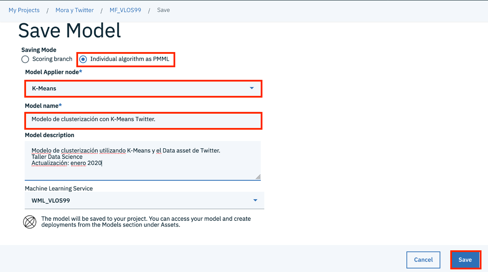

Ahora puedes pasar a:
[Desplegar y probar el modelo](#Desplegar-y-probar-el-modelo).

# Desplegar y probar el modelo
1. Para desplegar un modelo, lo primero que debemos hacer es regresar al proyecto. Para hacerlo, damos clic en el nombre del proyecto en la barra de direcciones, debajo del emblema de Watson Studio.
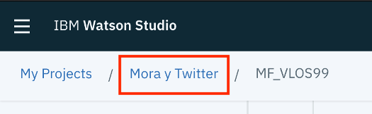
2. A continuación, estando en la pestaña “Assets”, en el apartado de “Models”, seleccionamos el que vayamos a desplegar. Para este ejemplo, utilizaré el de regresión logística.
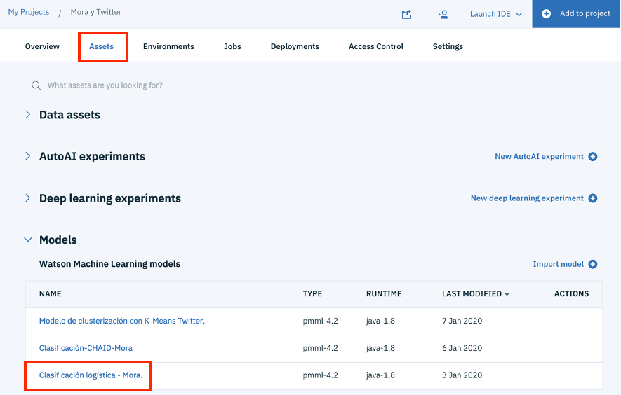
3. Ahora vamos a la pestaña de “Deployments” y damos clic en “Add Deployment”.
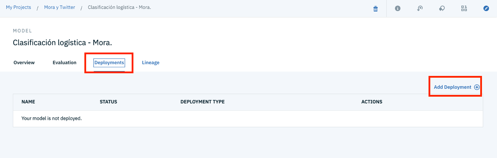
4.	Ahora le daremos un nombre a nuestro modelo y damos clic en “Save”. Nota: Recuerda asegurarte de que la opción “Web service” esté seleccionada.
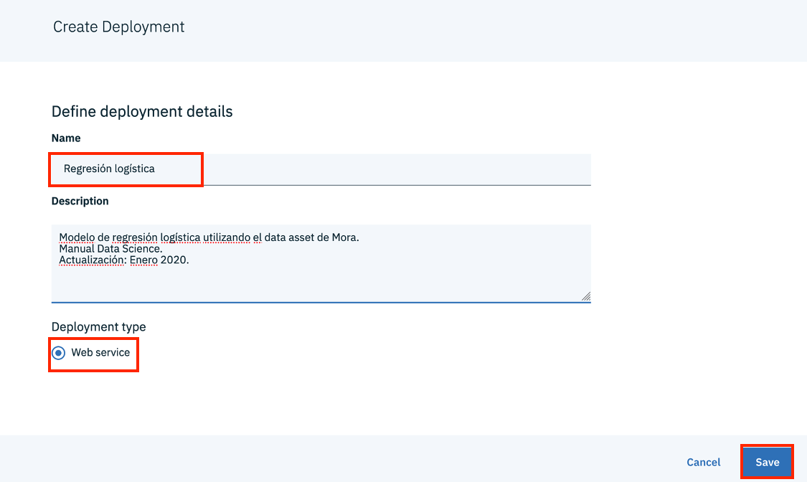
5.	Al regresar a la página de nuestro modelo, solo queda esperar a que el estado de nuestro modelo pase de “INITIALIZING” a “DEPLOY SUCCESS”.  Nota: En caso de que tarde más de un par de minutos, refresca la página. Una vez desplegado, damos clic en el modelo para poder probarlo.
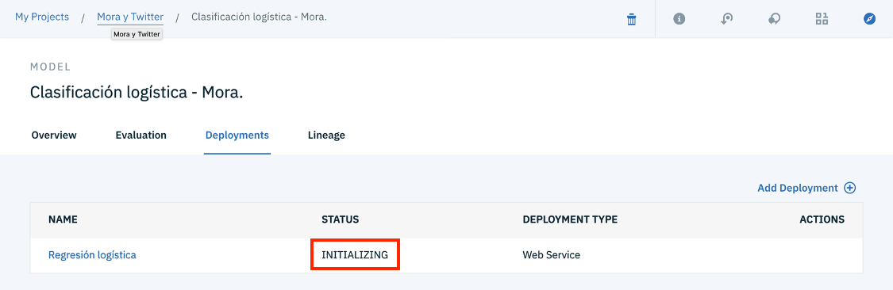
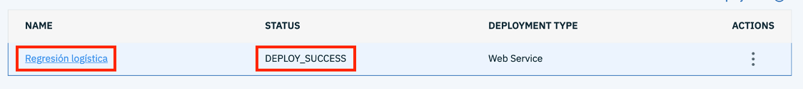
6.	Una vez dentro del modelo desplegado, damos clic a la pestaña “Test”, introducimos la información que nos pide y damos clic en “Predict”.
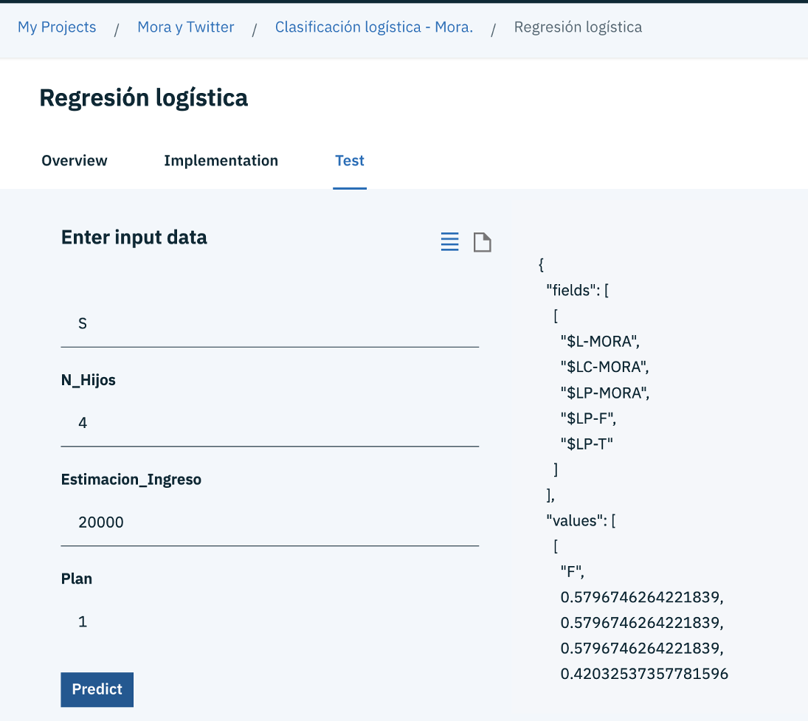
7.	Podemos apreciar el resultado del lado derecho: en este caso, la persona no tendría mora con una probabilidad aproximada del 57.9%.
8.	Para desplegar otro modelo, seguir los mismos pasos.
    -   [Modelo de regresion logística](#Modelo-de-regresion-logística).
    -   [Modelo de Clasificación](#Modelo-de-Clasificación).
    -   [Modelo de Clusterización](#Modelo-de-Clusterización).

**Te invitamos a explorar otros talleres y manuales en el siguiente enlace de Github.**
https://github.com/ibmdevelopermx

## Cupones para profesores y estudiantes:

* Acceder al portal de [IBM Academic Initiative][url-academic] y seleccionar la opción "Register now" si aun no tienes cuenta.
* Realizar el registro correspondiente utilizando la cuenta de correo académica y confirma tu cuenta.
* Despues de confirmar tu cuenta, y con la sesion iniciada en IBM Academic Initiative, en la parte de "Most Popular Topics covered", encontraremos **IBM Cloud** y damos clic en "Learn more".
* Bajamos de la pagina hasta encontrar "Software". Le damos clic, nos dara un apartado que se llama "Request Feature Code".
* Nos dara nuestro codigo. Lo copiamos y lo llevamos a **IBM Cloud**.

## Cargar créditos en IBM Cloud:

* En la parte superior derecha, buscaremos la parte de "MANAGE"/"GESTIONAR", nos desplegara una lista y seleccionaremos "Account"/"Cuenta".
* De lado izquierdo, tendremos una opción "Account settings"/"Configuracion de cuenta".
* Bajamos un poco hasta encontrar "Subscription and feature codes"/"Codigos de suscripción y carateristicas".
* Da clic en "Apply code"/"Aplicar codigo".
* Ingresamos el codigo y clic en "Apply"/"Aplicar".

[img-ibmcloud-powered]: https://img.shields.io/badge/IBM%20Cloud-Powered-blue.svg
[url-ibmcloudP]: https://www.ibm.com/cloud/
[img-ibmcloudds]: https://img.shields.io/badge/IBM%20Cloud-Data%20Science-blue.svg
[url-ibmcloudds]: https://www.ibm.com/analytics/data-science
[img-WS]: https://img.shields.io/badge/IBM%20Cloud-Watson%20Studio-9cf.svg
[url-WS]:https://www.ibm.com/cloud/watson-studio
[img-visual]: https://img.shields.io/badge/IBM%20Cloud-Watson%20Visual%20Recongnition-9cf.svg
[url-visual]: https://www.ibm.com/cloud/watson-visual-recognition
[img-machine]: https://img.shields.io/badge/IBM%20Cloud-Watson%20Machine%20Learning%20Accelerator-9cf.svg
[url-machine]: https://www.ibm.com/cloud/machine-learning
[imgspss]: https://img.shields.io/badge/IBM-SPSS%20Modeler-9cf.svg

[url-academic]: https://my15.digitalexperience.ibm.com/b73a5759-c6a6-4033-ab6b-d9d4f9a6d65b/dxsites/151914d1-03d2-48fe-97d9-d21166848e65/home/
[url-IBMCLOUD]: https://cloud.ibm.com/registration
[url-CLI-IBMCLOUD]: https://cloud.ibm.com/docs/cli/reference/ibmcloud?topic=cloud-cli-install-ibmcloud-cli
[url-github-join]: https://github.com/join
[url-github-cli]: https://git-scm.com/book/en/v2/Getting-Started-Installing-Git
[url-githubdesktop]: https://desktop.github.com/
[url-node]: https://nodejs.org/es/download/